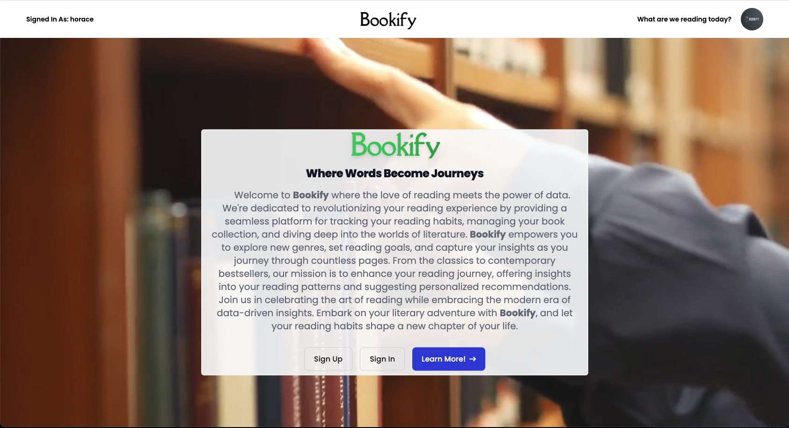

# challenge-portfolio

## Description

This Professional Portfolio webpage is designed to showcase my skills in HTML and CSS. I provide navigation links to the important sections within the webpage, wherein the user can find information about me, contact me, and view my portfolio collection on GitHub.

## Installation

N/A

## Usage

Each link in the navigation bar at the top of the page will bring you to the topic selected in the middle of the page. The links in the Contact Me section are live and user-friendly. The webpage will also adapt to re-sizing the screen to accomodate computers, tablets, and mobile phones.

## Screenshot

## Links

https://zbichsel.github.io/challenge-portfolio

https://www.github.com/zbichsel/challenge-portfolio

## Credits

N/A

## License

Please refer to the LICENSE in the repository.